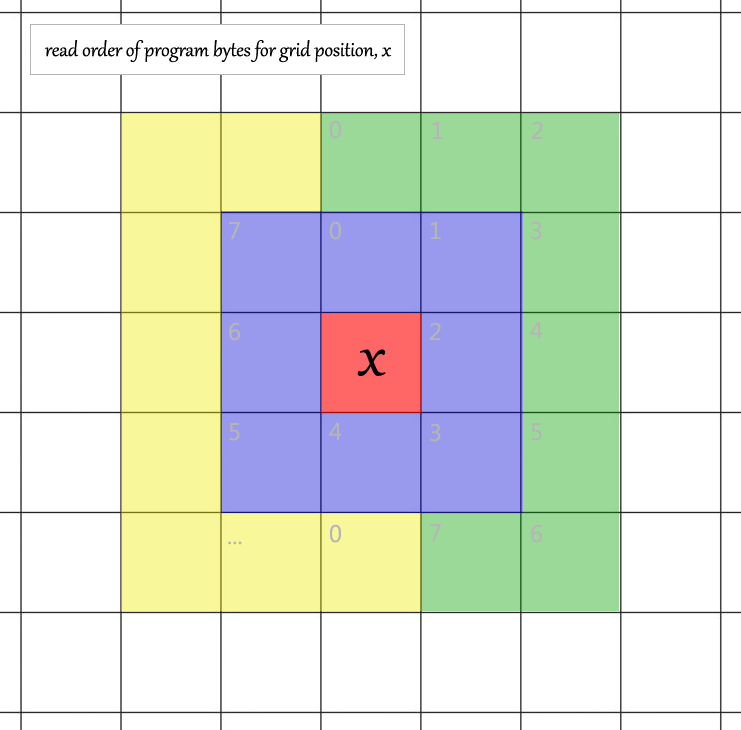

life
====

the self-programming game of life. or <i>splife</i>.

in conway's game of life, the rule set for each cell is fixed:
  1. any live cell with fewer than two live neighbours dies, as if caused by under-population.
  1. any live cell with two or three live neighbours lives on to the next generation.
  1. any live cell with more than three live neighbours dies, as if by overcrowding.
  1. any dead cell with exactly three live neighbours becomes a live cell, as if by reproduction.

in variations on conway's game, the rule set is parameterized (in one way or another). here he is in his own words.

[numberphile: inventing the game of life (john conway)](https://www.youtube.com/watch?v=R9Plq-D1gEk)

when asked, has the game of life been built upon, conway replies:

>no, it's finished. ... you can build upon it in the following sense: you can study particular configurations,
>you can find alternative rules that still have the same properties and so on, but, nothing, i think,
>that followed on it was just as interesting as the basic fact that this set of rules did exist, fairly simple,
>and have these astonishing properties.

after several years of searching, and thinking on the design presented here, i must now disagree: i think this is
_quite_ interesting. and! i think that others with more math/compsci sophistication than i have (which is not much!),
and who see the door that this opens and what is behind it, are _sure_ to improve upon it.

here is why.

in _splife_, as each cell is processed, the rules are expressed as a program stored in the grid itself, relative to
the position of that cell. the current state of the world, relative to the cell, and the rules for that cell, are one
and the same.

## Machine Description

program read order is clockwise, starting at "top dead center" for the row that the reader is currently on, spiraling
outward to each successive ring of cells (bits).

in this illustration and in the rest of this document the current cell is referred to as _x_:

cell _x_ is encircled by three bytes of code: blue, green, and yellow, in that order. the astute reader will note that
each ring contains exactly one more byte than the last.

as in virtually all other game-of-life variations, the current maximum/minimum extents of the living cells in the grid
define the boundary of the grid, thus what cells are processed, thus how many programs are run for a single generation.
addressing within a program is done relative to the cell being processed, so as to circumvent the issue of renumbering
memory addresses from a "true zero", typically the top left corner, whenever the grid expands/contracts.

the machine does not have a stack or heap. the grid state is self-evident, and it is its own program code, but nothing
else. i guess that might be interesting to look into, with a bigger word size, but first... read on.

## Registers

the splife machine offers two registers to a program.

`Rr` 
the result register. stores only one bit of information. initialized to zero at the beginning of each program
(each cell), and always written back to that cell when NOP/STOP is executed.

`Rc` 
the counter register. stores three bits of information. initialized to zero at the beginning of each program.
read/written by other instructions.

## Instructions

bitmasks for each instruction below describe which bits must be set to 1 or 0 and which are variable.

the first two bits of each instruction word indicate what will be executed, with the exception of the NOP/STOP and
unconditional JUMP instructions, which share the prefix bits `00`.

thus, there are five instructions.

#### NOP/STOP

  `00000000`

  __program read stops. the program is over.__

  * the current value of the result register Rr is written to cell position x.
  * lone cells die: this is their first/only instruction read (consistent with conway)

#### JUMP

  `00` `kkkkkk`

  __jump the next k instructions and resume execution__

  * k is a 6-bit, unsigned integer greater than zero (if zero, that would just be NOP/STOP)

#### CONDITIONAL JUMP

  `01` `kkkkkk`

  __jump the next k instructions if Rc is 1. resume read/execution there.__

  * `k` is a 6-bit, unsigned integer.

#### COMPARE

  `10` `fff` `kkk`

  __compare the counter register (LHS) to a constant value, k (RHS)__

  * f defines the comparison operator:
    * `100` equal
    * `010` less-than
    * `110` less-than-or-equal
    * `001` greater-than
    * `101` greater-than-or-equal
    * `000` false
    * `111` true
    * `011` not-equal
  * k is a 3-bit, unsigned integer
  * store the result to the result register, Rr
  * if true then store 1, otherwise 0

#### LOAD-INCREMENT

  `11` `uu` `ii` `jj`

  __reads a neighbor of x at offset i,j__

  * the second bit pair, value u, is ignored. this should be considered an undefined region.
  * if the cell at offset i,j from x is live, then add 1 to the counter register, Rc
  * i and j are 2-bit, _one's complement_ integers:
    * `00` zero
    * `01` one (e.g. right or down)
    * `10` negative one (e.g. left or up)
    * `11` negative zero. same as zero.
  * whenever 1 is added to Rc and it was already at its max value of seven, Rc overflows to zero.
  * there is no overflow flag.
